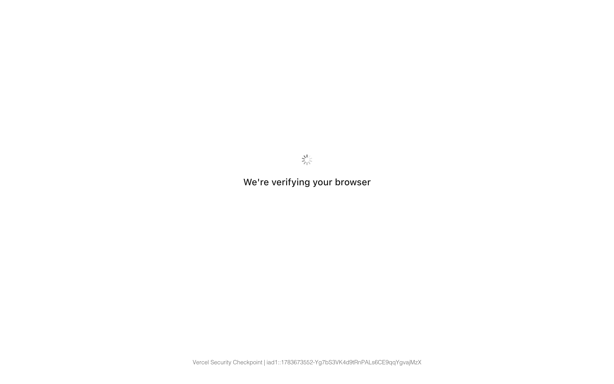

# kalshi-reference Design System

You are building UI for **kalshi-reference**. Dark-themed, cool palette, sans-serif typography (kalshiCondensed), compact density on a 4px grid, flat elevation (no shadows).

## Visual Reference

**IMPORTANT**: Study ALL screenshots below before writing any UI. Match colors, typography, spacing, layout, and motion exactly as shown.

### Homepage



### Scroll Journey (Cinematic Visual States)

> These screenshots capture the website at different scroll depths. The design changes dramatically as you scroll — each frame shows a different cinematic state. Replicate these exact visual transitions.

#### 0% — Hero / Above the fold


#### 17% — Mid-page at 17% scroll


#### 33% — Mid-page at 33% scroll


#### 50% — Mid-page at 50% scroll


#### 67% — Mid-page at 67% scroll


#### 83% — Mid-page at 83% scroll


#### 100% — Footer / End of page


> Read `references/DESIGN.md` for full token details. Read `references/ANIMATIONS.md` for motion specs. Read `references/LAYOUT.md` for layout structure. Read `references/COMPONENTS.md` for component patterns.

## Ultra Reference Files

This package includes extended documentation. **Read these files before implementing:**

| File | Contents |
|------|----------|
| `references/DESIGN.md` | Full design system tokens, colors, typography, spacing |
| `references/VISUAL_GUIDE.md` | **START HERE** — Master visual guide with all screenshots embedded |
| `references/ANIMATIONS.md` | CSS keyframes, scroll triggers, motion library stack, video specs |
| `references/LAYOUT.md` | Flex/grid containers, page structure, spacing relationships |
| `references/COMPONENTS.md` | DOM component patterns, HTML structure, class fingerprints |
| `references/INTERACTIONS.md` | Hover/focus states with before/after style diffs |
| `screens/scroll/` | 7 scroll journey screenshots showing cinematic states |

### Animation Stack Detected

- **Web Animations API (12 active)** — animation

## Design Philosophy

- **Flat elevation** — depth through color shifts and borders, never shadows. Surfaces get progressively lighter to indicate elevation.
- **Solid colors only** — no gradients anywhere. Every surface is a single flat color.
- **Type pairing** — kalshiCondensed for body/UI text, kalshiSans for headings/display. Never introduce a third typeface.
- **compact density** — 4px base grid. Every dimension is a multiple of 4.
- **cool palette** — the color temperature runs cool, matching the sans-serif typography.
- **Restrained accent** — `#28cc95` is the only pop of color. Used exclusively for CTAs, links, focus rings, and active states.
- **Minimal motion** — prefer instant state changes. Only use transitions for loading and page transitions.

## Color System

### Core Palette

| Role | Token | Hex | Use |
|------|-------|-----|-----|
| Background | `--background` | `#000000` | Page/app background |
| Text Primary | `--text-primary` | `#ffffff` | Headings, body text |
| Accent | `--accent` | `#28cc95` | CTAs, links, focus rings |

### Status Colors

| Status | Hex | Use |
|--------|-----|-----|
| Success | `#0ac285` | Confirmations, positive trends |
| Danger | `#d91616` | Errors, destructive actions |

### Extended Palette

- `#265cff`

### CSS Variable Tokens

```css
--surface-foreground: #0000000d;
--surface-foreground-opaque: #f7f7f7;
--brand-primary: #28cc95;
--brand-secondary: #003221;
--bprogress-spinner-border-size: 2px;
```

## Typography

### Font Stack

- **kalshiCondensed** — Heading 1, Heading 2, Heading 3
- **kalshiSans** — Body, Caption

### Type Scale

| Role | Family | Size | Weight |
|------|--------|------|--------|
| Heading 1 | kalshiCondensed | 48px / 3rem | 700 |
| Heading 2 | kalshiCondensed | 32px / 2rem | 600 |
| Heading 3 | kalshiCondensed | 24px / 1.5rem | 600 |
| Body | kalshiSans | 16px / 1rem | 400 |
| Caption | kalshiSans | 12px / 0.75rem | 400 |

### Typography Rules

- Body/UI: **kalshiCondensed**, Headings: **kalshiSans** — these are the only display fonts
- Max 3-4 font sizes per screen
- Headings: weight 600-700, body: weight 400
- Use color and opacity for text hierarchy, not additional font sizes
- Line height: 1.5 for body, 1.2 for headings

## Spacing & Layout

### Base Grid: 4px

Every dimension (margin, padding, gap, width, height) must be a multiple of **4px**.

### Spacing Scale

`2, 4, 6, 8, 12, 16, 24, 32, 80` px

### Spacing as Meaning

| Spacing | Use |
|---------|-----|
| 4-8px | Tight: related items (icon + label, avatar + name) |
| 12-16px | Medium: between groups within a section |
| 24-32px | Wide: between distinct sections |
| 48px+ | Vast: major page section breaks |

### Border Radius

Scale: `6px, 8px, 16px, 100px`
Default: `16px`

## Component Patterns

### Card

```css
.card {
  background: #000000;
  border-radius: 16px;
  padding: 16px;
}
```

```html
<div class="card">
  <h3>Card Title</h3>
  <p>Card content goes here.</p>
</div>
```

### Button

```css
/* Primary */
.btn-primary {
  background: #28cc95;
  color: #ffffff;
  border-radius: 16px;
  padding: 8px 16px;
  font-weight: 500;
  transition: opacity 150ms ease;
}
.btn-primary:hover { opacity: 0.9; }

/* Ghost */
.btn-ghost {
  background: transparent;
  border: 1px solid #444444;
  color: #ffffff;
  border-radius: 16px;
  padding: 8px 16px;
}
```

```html
<button class="btn-primary">Get Started</button>
<button class="btn-ghost">Learn More</button>
```

### Input

```css
.input {
  background: #000000;
  border: 1px solid #444444;
  border-radius: 16px;
  padding: 8px 12px;
  color: #ffffff;
  font-size: 14px;
}
.input:focus { border-color: #28cc95; outline: none; }
```

```html
<input class="input" type="text" placeholder="Search..." />
```

### Badge / Chip

```css
.badge {
  display: inline-flex;
  align-items: center;
  padding: 4px 8px;
  border-radius: 9999px;
  font-size: 12px;
  font-weight: 500;
  background: #000000;
  color: #8c8c8c;
}
```

```html
<span class="badge">New</span>
<span class="badge">Beta</span>
```

### Modal / Dialog

```css
.modal-backdrop { background: rgba(0, 0, 0, 0.6); }
.modal {
  background: #000000;
  border-radius: 100px;
  padding: 24px;
  max-width: 480px;
  width: 90vw;
}
```

```html
<div class="modal-backdrop">
  <div class="modal">
    <h2>Dialog Title</h2>
    <p>Dialog content.</p>
    <button class="btn-primary">Confirm</button>
    <button class="btn-ghost">Cancel</button>
  </div>
</div>
```

### Table

```css
.table { width: 100%; border-collapse: collapse; }
.table th {
  text-align: left;
  padding: 8px 12px;
  font-weight: 500;
  font-size: 12px;
  color: #8c8c8c;
  text-transform: uppercase;
  letter-spacing: 0.05em;
  border-bottom: 1px solid #444444;
}
.table td {
  padding: 12px;
  border-bottom: 1px solid #444444;
}
```

```html
<table class="table">
  <thead><tr><th>Name</th><th>Status</th><th>Date</th></tr></thead>
  <tbody>
    <tr><td>Item One</td><td>Active</td><td>Jan 1</td></tr>
    <tr><td>Item Two</td><td>Pending</td><td>Jan 2</td></tr>
  </tbody>
</table>
```

### Navigation

```css
.nav {
  display: flex;
  align-items: center;
  gap: 8px;
  padding: 12px 16px;
}
.nav-link {
  color: #8c8c8c;
  padding: 8px 12px;
  border-radius: 16px;
  transition: color 150ms;
}
.nav-link:hover { color: #ffffff; }
.nav-link.active { color: #28cc95; }
```

```html
<nav class="nav">
  <a href="/" class="nav-link active">Home</a>
  <a href="/about" class="nav-link">About</a>
  <a href="/pricing" class="nav-link">Pricing</a>
  <button class="btn-primary" style="margin-left: auto">Get Started</button>
</nav>
```

## Animation & Motion

This project uses **subtle motion**. Transitions smooth state changes without calling attention.

### Motion Guidelines

- **Duration:** 150-300ms for micro-interactions, 300-500ms for page transitions
- **Easing:** `ease-out` for enters, `ease-in` for exits
- **Direction:** Elements enter from bottom/right, exit to top/left
- **Reduced motion:** Always respect `prefers-reduced-motion` — disable animations when set

## Depth & Elevation

This design uses **flat elevation** — no box-shadows anywhere.

### Elevation Strategy

| Level | Technique | Use |
|-------|-----------|-----|
| 0 — Base | Background color | Page background |
| 1 — Raised | Lighter surface + subtle border | Cards, panels |
| 2 — Floating | Even lighter surface + stronger border | Dropdowns, popovers |
| 3 — Overlay | Backdrop + modal surface | Modals, dialogs |

## Anti-Patterns (Never Do)

- **No box-shadow** on any element — use borders and surface colors for depth
- **No gradients** — solid colors only, everywhere
- **No blur effects** — no backdrop-blur, no filter: blur()
- **No zebra striping** — tables and lists use borders for separation
- **No invented colors** — every hex value must come from the palette above
- **No arbitrary spacing** — every dimension is a multiple of 4px
- **No extra fonts** — only kalshiCondensed and kalshiSans are allowed
- **No arbitrary border-radius** — use the scale: 6px, 8px, 16px, 100px
- **No opacity for disabled states** — use muted colors instead
- **No pill shapes** — this design doesn't use rounded-full / 9999px radius

## Workflow

1. **Read** `references/DESIGN.md` before writing any UI code
2. **Pick colors** from the Color System section — never invent new ones
3. **Set typography** — kalshiCondensed, kalshiSans only, using the type scale
4. **Build layout** on the 4px grid — check every margin, padding, gap
5. **Match components** to patterns above before creating new ones
6. **Apply elevation** — flat, surface color shifts only
7. **Validate** — every value traces back to a design token. No magic numbers.

## Brand Spec

- **Site URL:** `https://kalshi.com`
- **Brand color:** `#28cc95`
- **Brand typeface:** kalshiCondensed

## Quick Reference

```
Background:     #000000
Surface:        (not extracted)
Text:           #ffffff / (not extracted)
Accent:         #28cc95
Border:         (not extracted)
Font:           kalshiCondensed
Spacing:        4px grid
Radius:         16px
Components:     0 detected
```

## When to Trigger

Activate this skill when:
- Creating new components, pages, or visual elements for kalshi-reference
- Writing CSS, Tailwind classes, styled-components, or inline styles
- Building page layouts, templates, or responsive designs
- Reviewing UI code for design consistency
- The user mentions "kalshi-reference" design, style, UI, or theme
- Generating mockups, wireframes, or visual prototypes

---

# Full Reference Files

> Every output file is embedded below. Claude has full design system context from /skills alone.

## Design System Tokens (DESIGN.md)

# kalshi-reference DESIGN.md

> Auto-generated design system — reverse-engineered via static analysis by skillui.
> Frameworks: None detected
> Colors: 6 · Fonts: 2 · Components: 0
> Icon library: not detected · State: not detected
> Primary theme: dark · Dark mode toggle: no · Motion: none

## Visual Reference

**Match this design exactly** — study colors, fonts, spacing, and component shapes before writing any UI code.


---

## 1. Visual Theme & Atmosphere

This is a **dark-themed** interface with a flat, cool visual language. Elevation is achieved through color and border shifts rather than shadows — a clean, industrial aesthetic. Typography pairs **kalshiSans** for display/headings with **kalshiCondensed** for body text, creating clear visual hierarchy through type contrast. Spacing follows a **4px base grid** (compact density), with scale: 2, 4, 6, 8, 12, 16, 24, 32px. The accent color **#28cc95** anchors interactive elements (buttons, links, focus rings).

---

## 2. Color Palette & Roles

| Token | Hex | Role | Use |
|---|---|---|---|
| background | `#000000` | background | Page background, darkest surface |
| text-primary | `#ffffff` | text-primary | Headings and body text |
| accent | `#28cc95` | accent | CTAs, links, focus rings, active states |
| danger | `#d91616` | danger | Error states, destructive actions |
| success | `#0ac285` | success | Success states, positive indicators |
| info | `#265cff` | info | Informational highlights |

### CSS Variable Tokens

```css
--surface-foreground: #0000000d;
--surface-foreground-opaque: #f7f7f7;
--brand-primary: #28cc95;
--brand-secondary: #003221;
--bprogress-spinner-border-size: 2px;
```


---

## 3. Typography Rules

**Font Stack:**
- **kalshiCondensed** — Heading 1, Heading 2, Heading 3
- **kalshiSans** — Body, Caption

| Role | Font | Size | Weight |
|---|---|---|---|
| Heading 1 | kalshiCondensed | 48px / 3rem | 700 |
| Heading 2 | kalshiCondensed | 32px / 2rem | 600 |
| Heading 3 | kalshiCondensed | 24px / 1.5rem | 600 |
| Body | kalshiSans | 16px / 1rem | 400 |
| Caption | kalshiSans | 12px / 0.75rem | 400 |

**Typographic Rules:**
- Limit to 2 font families max per screen
- Use **kalshiCondensed** for body/UI text, **kalshiSans** for display/headings
- Maintain consistent hierarchy: no more than 3-4 font sizes per screen
- Headings use bold (600-700), body uses regular (400)
- Line height: 1.5 for body text, 1.2 for headings
- Use color and opacity for secondary hierarchy, not additional font sizes


---

## 4. Component Stylings

No components detected. Scan `src/components/` or `components/` to populate this section.

---

## 5. Layout Principles

- **Base spacing unit:** 4px
- **Spacing scale:** 2, 4, 6, 8, 12, 16, 24, 32, 80
- **Border radius:** 6px, 8px, 16px, 100px

**Spacing as Meaning:**
| Spacing | Use |
|---|---|
| 4-8px | Tight: related items within a group |
| 12-16px | Medium: between groups |
| 24-32px | Wide: between sections |
| 48px+ | Vast: major section breaks |


---

## 6. Depth & Elevation

No box-shadow values detected. The design uses a **flat visual style** — elevation is conveyed through background color shifts and borders rather than shadows.

**Elevation Strategy:**
| Level | Technique | Use |
|---|---|---|
| 0 — Base | Background color | Page background |
| 1 — Raised | Lighter surface + subtle border | Cards, panels |
| 2 — Floating | Even lighter surface + stronger border | Dropdowns, popovers |
| 3 — Overlay | Backdrop + modal surface | Modals, dialogs |


---

## 8. Do's and Don'ts

### Do's

- Use `#28cc95` for interactive elements (buttons, links, focus rings)
- Use `#000000` as the primary page background
- Pair **kalshiCondensed** (body) with **kalshiSans** (display) — these are the only allowed fonts
- Follow the **4px** spacing grid for all margins, padding, and gaps
- Use border and background shifts for elevation — not shadows
- Use border-radius from the scale: 6px, 8px, 16px, 100px

### Don'ts

- Don't introduce colors outside this palette — extend the design tokens first
- Don't introduce additional font families beyond kalshiCondensed and kalshiSans
- Don't use arbitrary spacing values — stick to multiples of 4px
- Don't add box-shadow — this design system uses flat elevation
- Don't use gradients — the design uses solid colors only
- Don't use arbitrary border-radius values — pick from the defined scale
- Don't use backdrop-blur or blur effects

### Anti-Patterns (detected from codebase)

- No box-shadow on any element
- No gradient backgrounds
- No blur or backdrop-blur effects
- No zebra striping on tables/lists


---

## 9. Responsive Behavior

No breakpoints detected. Consider adding responsive breakpoints to the design system.

---

## 10. Agent Prompt Guide

Use these as starting points when building new UI:

### Build a Card

```
Background: #000000
Border: 1px solid var(--border)
Radius: 16px
Padding: 16px
Font: kalshiCondensed
No shadows — use borders and surface colors for depth.
```

### Build a Button

```
Primary: bg #28cc95, text white
Ghost: bg transparent, border var(--border)
Padding: 8px 16px
Radius: 16px
Hover: opacity 0.9 or lighter shade
Focus: ring with #28cc95
```

### Build a Page Layout

```
Background: #000000
Max-width: 1280px, centered
Grid: 4px base
Responsive: mobile-first, breakpoints from Section 9
```

### Build a Stats Card

```
Surface: #000000
Label: var(--text-muted) (muted, 12px, uppercase)
Value: #ffffff (primary, 24-32px, bold)
Status: use success/warning/danger from Section 2
```

### Build a Form

```
Input bg: #000000
Input border: 1px solid var(--border)
Focus: border-color #28cc95
Label: var(--text-muted) 12px
Spacing: 16px between fields
Radius: 16px
```

### General Component

```
1. Read DESIGN.md Sections 2-6 for tokens
2. Colors: only from palette
3. Font: kalshiCondensed, type scale from Section 3
4. Spacing: 4px grid
5. Components: match patterns from Section 4
6. Elevation: flat, surface shifts
```

## Visual Guide — Screenshots (VISUAL_GUIDE.md)

# kalshi-reference — Visual Guide

> Master visual reference. Study every screenshot carefully before implementing any UI.
> Match colors, layout, typography, spacing, and motion states exactly.

**Motion Stack:** **Web Animations API (12 active)**

## Scroll Journey

The page has cinematic scroll animations. Each screenshot below shows the exact visual state at that scroll depth.
**Replicate these transitions precisely** — the design changes dramatically as you scroll.

### Hero — Above the fold

*Scroll position: 0px of 4100px total*


### 17% scroll depth

*Scroll position: 544px of 4100px total*


### 33% scroll depth

*Scroll position: 1056px of 4100px total*


### 50% scroll depth

*Scroll position: 0px of 4100px total*


### 67% scroll depth

*Scroll position: 0px of 4100px total*


### 83% scroll depth

*Scroll position: 0px of 4100px total*


### Footer — End of page

*Scroll position: 0px of 4100px total*


## Full Page Screenshots

### Kalshi - Prediction Market for Trading the Future

*URL: `https://kalshi.com`*


### Browse Markets | Kalshi

*URL: `https://kalshi.com/browse`*


### Perpetual Futures - Kalshi

*URL: `https://kalshi.com/perps`*


### Kalshi Event Calendar: Trade on Future Events

*URL: `https://kalshi.com/calendar`*


### Kalshi Social

*URL: `https://kalshi.com/ideas/feed`*


### Kalshi Research

*URL: `https://kalshi.com/research/mission`*


### Election Prediction Markets & Political Odds | Kalshi

*URL: `https://kalshi.com/category/elections`*


### Politics Prediction Markets & Odds | Kalshi

*URL: `https://kalshi.com/category/politics`*


## Section Screenshots

Clipped sections showing individual components in context.

### Section 1 — `section`

*880×427px*


### Section 2 — `section`

*880×1200px*


## Animations & Motion (ANIMATIONS.md)

# Animation Reference

> Cinematic motion design extracted from live DOM. Follow these specs exactly to recreate the experience.

## Motion Technology Stack

| Library | Type | Notes |
|---------|------|-------|
| **Web Animations API (12 active)** | animation |  |

## Scroll Journey

The page is **4,100px** tall. Each frame below shows what the user sees at that scroll depth.

> **Use these screenshots to understand WHAT animates, WHEN it animates, and HOW it moves.**

### 0% — Top / Hero
Scroll position: 0px


### 17% — Opening Section
Scroll position: 544px


### 33% — First Feature Section
Scroll position: 1,056px


### 50% — Mid-Page
Scroll position: 0px


### 67% — Lower Content
Scroll position: 0px


### 83% — Near Footer
Scroll position: 0px


### 100% — Bottom / Footer
Scroll position: 0px


## Scroll Animation Patterns

| Pattern | Library | Element Count | Duration | Delay | Easing |
|---------|---------|---------------|----------|-------|--------|
| parallax / sticky scroll | CSS | 1 | — | — | — |

### CSS Implementation

## CSS Keyframes (40 extracted)

### `@keyframes fadeIn`

Duration: `3s, 0.6s` · Easing: `linear, ease` · Delay: `0s, 0s` · Iteration: `1, 1` · Fill: `none, none`

Used by: `.animate-\[expandHeight_3s_linear\,fadeIn_0\.6s_ease\]`, `.animate-\[fadeIn_0\.1s_ease_forwards\]`, `.animate-\[fadeIn_0\.3s_ease-in-out\]`, `.animate-\[fadeIn_0\.3s_ease_0\.1s_forwards\,slideIntoPosition_0\.3s_ease_0\.1s_`

```css
@keyframes fadeIn {
  0% {
    opacity: 0;
  }
  100% {
    opacity: 1;
  }
}
```

> Opacity fade

### `@keyframes fadeOut`

Duration: `0.45s` · Easing: `cubic-bezier(0.66, 0, 0.34, 1)` · Delay: `0s` · Iteration: `1` · Fill: `none`

Used by: `.animate-fade-out`, `.data-\[state\=closed\]\:animate-\[fadeOut_0\.2s_ease\][data-state="closed"]`, `.data-\[state\=closed\]\:animate-quick-fade-out[data-state="closed"]`

```css
@keyframes fadeOut {
  0% {
    opacity: 1;
  }
  100% {
    opacity: 0;
  }
}
```

> Opacity fade

### `@keyframes hideshow`

Duration: `1.5s` · Easing: `ease` · Delay: `0s` · Iteration: `infinite` · Fill: `none`

Used by: `.animate-hideshow`, `.animate-hideshow-live`

```css
@keyframes hideshow {
  0% {
    opacity: 0.12;
  }
  30% {
    opacity: 1;
  }
  70% {
    opacity: 1;
  }
  100% {
    opacity: 0.12;
  }
}
```

> Opacity fade

### `@keyframes shimmerGradient`

Duration: `2s` · Easing: `linear` · Delay: `0s` · Iteration: `infinite` · Fill: `none`

Used by: `.animate-shimmer-gradient`, `.animate-skeleton-shimmer`

```css
@keyframes shimmerGradient {
  0% {
    background-position-x: 200%;
    background-position-y: 0px;
  }
  100% {
    background-position-x: -200%;
    background-position-y: 0px;
  }
}
```

> Background color/gradient shift · Background position (shimmer/scroll)

### `@keyframes shimmerGradient`

Duration: `2s` · Easing: `linear` · Delay: `0s` · Iteration: `infinite` · Fill: `none`

Used by: `.animate-shimmer-gradient`, `.animate-skeleton-shimmer`

```css
@keyframes shimmerGradient {
  0% {
    background-position-x: 200%;
    background-position-y: 0px;
  }
  100% {
    background-position-x: -200%;
    background-position-y: 0px;
  }
}
```

> Background color/gradient shift · Background position (shimmer/scroll)

### `@keyframes expandHeight`

Duration: `3s, 0.6s` · Easing: `linear, ease` · Delay: `0s, 0s` · Iteration: `1, 1` · Fill: `none, none`

Used by: `.animate-\[expandHeight_3s_linear\,fadeIn_0\.6s_ease\]`

```css
@keyframes expandHeight {
  0% {
    max-height: 0px;
  }
  100% {
    max-height: 1000px;
  }
}
```

> Dimension expand/collapse

### `@keyframes slideIntoPosition`

Duration: `0.3s, 0.3s` · Easing: `ease, ease` · Delay: `0.1s, 0.1s` · Iteration: `1, 1` · Fill: `forwards, forwards`

Used by: `.animate-\[fadeIn_0\.3s_ease_0\.1s_forwards\,slideIntoPosition_0\.3s_ease_0\.1s_`

```css
@keyframes slideIntoPosition {
  0% {
    transform: translateY(24px);
  }
  100% {
    transform: none;
  }
}
```

> Transform/motion animation

### `@keyframes heartbeat`

Duration: `3s` · Easing: `cubic-bezier(0.32, 0.93, 0.6, 1)` · Delay: `0s` · Iteration: `infinite` · Fill: `none`

Used by: `.animate-\[heartbeat_3s_cubic-bezier\(0\.32\,0\.93\,0\.60\,1\.00\)_infinite\]`

```css
@keyframes heartbeat {
  0% {
    stroke-width: 0;
    stroke-opacity: 1;
  }
  100% {
    stroke-width: 16px;
    stroke-opacity: 0;
  }
}
```

> Opacity fade · SVG stroke animation

### `@keyframes autoInsertPost`

Duration: `0.8s` · Easing: `ease-in-out` · Delay: `0s` · Iteration: `1` · Fill: `none`

Used by: `.animate-auto-insert-post`

```css
@keyframes autoInsertPost {
  0% {
    background-color: rgba(10, 194, 133, 0.12);
  }
  100% {
    background-color: rgba(0, 0, 0, 0);
  }
}
```

> Background color/gradient shift · Text color shift

### `@keyframes bounce`

Duration: `1s` · Easing: `ease` · Delay: `0s` · Iteration: `infinite` · Fill: `none`

Used by: `.animate-bounce`

```css
@keyframes bounce {
  0%, 100% {
    animation-timing-function: cubic-bezier(0.8, 0, 1, 1);
    transform: translateY(-25%);
  }
  50% {
    animation-timing-function: cubic-bezier(0, 0, 0.2, 1);
    transform: none;
  }
}
```

> Transform/motion animation

### `@keyframes slideLeft`

Duration: `0.3s` · Easing: `ease-in-out` · Delay: `0s` · Iteration: `1` · Fill: `none`

Used by: `.animate-bracket-slide-left`

```css
@keyframes slideLeft {
  0% {
    transform: translate(0px);
  }
  100% {
    transform: translate(-25%);
  }
}
```

> Transform/motion animation

### `@keyframes slideRight`

Duration: `0.3s` · Easing: `ease-in-out` · Delay: `0s` · Iteration: `1` · Fill: `none`

Used by: `.animate-bracket-slide-right`

```css
@keyframes slideRight {
  0% {
    transform: translate(-25%);
  }
  100% {
    transform: translate(0px);
  }
}
```

> Transform/motion animation

### `@keyframes expandGrid`

Duration: `80ms` · Easing: `ease-out` · Delay: `0s` · Iteration: `1` · Fill: `both`

Used by: `.animate-expand-grid`

```css
@keyframes expandGrid {
  0% {
    opacity: 0;
    grid-template-rows: 0fr;
  }
  100% {
    opacity: 1;
    grid-template-rows: 1fr;
  }
}
```

> Opacity fade

### `@keyframes grow`

Duration: `0.6s` · Easing: `ease` · Delay: `0s` · Iteration: `1` · Fill: `forwards`

Used by: `.animate-grow`

```css
@keyframes grow {
  0% {
    max-height: 88px;
  }
  100% {
    max-height: 800px;
  }
}
```

> Dimension expand/collapse

### `@keyframes heightContract`

Duration: `0.3s` · Easing: `ease-in-out` · Delay: `0s` · Iteration: `1` · Fill: `none`

Used by: `.animate-height-contract`

```css
@keyframes heightContract {
  0% {
    max-height: 100%;
  }
  100% {
    max-height: 50%;
  }
}
```

> Dimension expand/collapse

### `@keyframes liveBracketGradientShift`

Duration: `1.4s` · Easing: `ease-in-out` · Delay: `0s` · Iteration: `infinite` · Fill: `none`

Used by: `.animate-live-bracket-gradient`

```css
@keyframes liveBracketGradientShift {
  0% {
    background-color: rgba(217, 22, 22, 0.12);
  }
  50% {
    background-color: rgba(217, 22, 22, 0.5);
  }
  100% {
    background-color: rgba(217, 22, 22, 0.12);
  }
}
```

> Background color/gradient shift · Background position (shimmer/scroll)

### `@keyframes marquee`

Duration: `30s` · Easing: `linear` · Delay: `0s` · Iteration: `infinite` · Fill: `none`

Used by: `.animate-marquee`

```css
@keyframes marquee {
  0% {
    transform: translate(0px);
  }
  100% {
    transform: translate(-50%);
  }
}
```

> Transform/motion animation

### `@keyframes orderbookFlash`

Duration: `0.8s` · Easing: `ease` · Delay: `0s` · Iteration: `1` · Fill: `both`

Used by: `.animate-orderbook-flash`

```css
@keyframes orderbookFlash {
  0% {
    opacity: 0;
  }
  20% {
    opacity: 0.35;
  }
  100% {
    opacity: 0;
  }
}
```

> Opacity fade

### `@keyframes ping`

Duration: `1s` · Easing: `cubic-bezier(0, 0, 0.2, 1)` · Delay: `0s` · Iteration: `infinite` · Fill: `none`

Used by: `.animate-ping`

```css
@keyframes ping {
  75%, 100% {
    opacity: 0;
    transform: scale(2);
  }
}
```

> Fade + motion enter animation

### `@keyframes pulse`

Duration: `2s` · Easing: `cubic-bezier(0.4, 0, 0.6, 1)` · Delay: `0s` · Iteration: `infinite` · Fill: `none`

Used by: `.animate-pulse`

```css
@keyframes pulse {
  50% {
    opacity: 0.5;
  }
}
```

> Opacity fade

### `@keyframes rotate`

Duration: `0.8s` · Easing: `ease-in-out` · Delay: `0s` · Iteration: `1` · Fill: `none`

Used by: `.animate-rotate`

```css
@keyframes rotate {
  0% {
    transform: rotate(0deg);
  }
  100% {
    transform: rotate(360deg);
  }
}
```

> Transform/motion animation

### `@keyframes sheen`

Duration: `0.4s` · Easing: `ease-out` · Delay: `0s` · Iteration: `1` · Fill: `forwards`

Used by: `.animate-sheen`

```css
@keyframes sheen {
  0% {
    transform: translate(-100%);
  }
  100% {
    transform: translate(100%);
  }
}
```

> Transform/motion animation

### `@keyframes slideIn`

Duration: `0.35s` · Easing: `cubic-bezier(0.22, 1, 0.36, 1)` · Delay: `0s` · Iteration: `1` · Fill: `both`

Used by: `.animate-slide-in`

```css
@keyframes slideIn {
  0% {
    opacity: 0;
    transform: translateY(-30px);
  }
  100% {
    opacity: 1;
    transform: translateY(0px);
  }
}
```

> Fade + motion enter animation

### `@keyframes softFlashDown`

Duration: `59s` · Easing: `ease` · Delay: `0s` · Iteration: `1` · Fill: `none`

Used by: `.animate-soft-flash-down`

```css
@keyframes softFlashDown {
  0% {
    background-color: rgba(255, 82, 82, 0.15);
  }
  100% {
    background-color: rgba(0, 0, 0, 0);
  }
}
```

> Background color/gradient shift · Text color shift

### `@keyframes softFlashUp`

Duration: `59s` · Easing: `ease` · Delay: `0s` · Iteration: `1` · Fill: `none`

Used by: `.animate-soft-flash-up`

```css
@keyframes softFlashUp {
  0% {
    background-color: rgba(10, 194, 133, 0.15);
  }
  100% {
    background-color: rgba(0, 0, 0, 0);
  }
}
```

> Background color/gradient shift · Text color shift

### `@keyframes spin`

Duration: `1s` · Easing: `linear` · Delay: `0s` · Iteration: `infinite` · Fill: `none`

Used by: `.animate-spin`

```css
@keyframes spin {
  100% {
    transform: rotate(360deg);
  }
}
```

> Transform/motion animation

### `@keyframes collapsible-up`

Duration: `0.3s` · Easing: `ease-out` · Delay: `0s` · Iteration: `1` · Fill: `none`

Used by: `.data-\[state\=closed\]\:animate-collapsible-up[data-state="closed"]`

```css
@keyframes collapsible-up {
  0% {
    height: var(--radix-collapsible-content-height);
  }
  100% {
    height: 0px;
  }
}
```

> Dimension expand/collapse

### `@keyframes collapsible-down`

Duration: `0.3s` · Easing: `ease-out` · Delay: `0s` · Iteration: `1` · Fill: `none`

Used by: `.data-\[state\=open\]\:animate-collapsible-down[data-state="open"]`

```css
@keyframes collapsible-down {
  0% {
    height: 0px;
  }
  100% {
    height: var(--radix-collapsible-content-height);
  }
}
```

> Dimension expand/collapse

### `@keyframes chartRevealWipe`

Duration: `1.2s` · Easing: `cubic-bezier(0.66, 0, 0.34, 1)` · Delay: `0s` · Iteration: `1` · Fill: `forwards`

Used by: `.chart-reveal-wipe`

```css
@keyframes chartRevealWipe {
  0% {
    transform: scaleX(0);
  }
  100% {
    transform: scaleX(1);
  }
}
```

> Transform/motion animation

### `@keyframes swipe-out-left`

Used by: `[data-sonner-toast][data-swipe-out="true"][data-swipe-direction="left"]`

```css
@keyframes swipe-out-left {
  0% {
    transform: var(--y) translateX(var(--swipe-amount-x));
    opacity: 1;
  }
  100% {
    transform: var(--y) translateX(calc(var(--swipe-amount-x) - 100%));
    opacity: 0;
  }
}
```

> Fade + motion enter animation

### `@keyframes swipe-out-right`

Used by: `[data-sonner-toast][data-swipe-out="true"][data-swipe-direction="right"]`

```css
@keyframes swipe-out-right {
  0% {
    transform: var(--y) translateX(var(--swipe-amount-x));
    opacity: 1;
  }
  100% {
    transform: var(--y) translateX(calc(var(--swipe-amount-x) + 100%));
    opacity: 0;
  }
}
```

> Fade + motion enter animation

### `@keyframes swipe-out-up`

Used by: `[data-sonner-toast][data-swipe-out="true"][data-swipe-direction="up"]`

```css
@keyframes swipe-out-up {
  0% {
    transform: var(--y) translateY(var(--swipe-amount-y));
    opacity: 1;
  }
  100% {
    transform: var(--y) translateY(calc(var(--swipe-amount-y) - 100%));
    opacity: 0;
  }
}
```

> Fade + motion enter animation

### `@keyframes swipe-out-down`

Used by: `[data-sonner-toast][data-swipe-out="true"][data-swipe-direction="down"]`

```css
@keyframes swipe-out-down {
  0% {
    transform: var(--y) translateY(var(--swipe-amount-y));
    opacity: 1;
  }
  100% {
    transform: var(--y) translateY(calc(var(--swipe-amount-y) + 100%));
    opacity: 0;
  }
}
```

> Fade + motion enter animation

### `@keyframes sonner-fade-in`

Duration: `0.3s` · Easing: `ease` · Delay: `0s` · Iteration: `1` · Fill: `forwards`

Used by: `[data-sonner-toast][data-promise="true"] [data-icon] > svg`

```css
@keyframes sonner-fade-in {
  0% {
    opacity: 0;
    transform: scale(0.8);
  }
  100% {
    opacity: 1;
    transform: scale(1);
  }
}
```

> Fade + motion enter animation

### `@keyframes sonner-fade-out`

Duration: `0.2s` · Easing: `ease` · Delay: `0s` · Iteration: `1` · Fill: `forwards`

Used by: `.sonner-loading-wrapper[data-visible="false"]`

```css
@keyframes sonner-fade-out {
  0% {
    opacity: 1;
    transform: scale(1);
  }
  100% {
    opacity: 0;
    transform: scale(0.8);
  }
}
```

> Fade + motion enter animation

### `@keyframes sonner-spin`

Duration: `1.2s` · Easing: `linear` · Delay: `0s` · Iteration: `infinite` · Fill: `none`

Used by: `.sonner-loading-bar`

```css
@keyframes sonner-spin {
  0% {
    opacity: 1;
  }
  100% {
    opacity: 0.15;
  }
}
```

> Opacity fade

### `@keyframes bprogress-indeterminate-increase`

Duration: `2s` · Easing: `ease` · Delay: `0s` · Iteration: `infinite` · Fill: `none`

Used by: `.bprogress .indeterminate .inc`

```css
@keyframes bprogress-indeterminate-increase {
  0% {
    left: -5%;
    width: 5%;
  }
  100% {
    left: 130%;
    width: 100%;
  }
}
```

> Dimension expand/collapse

### `@keyframes bprogress-indeterminate-decrease`

Duration: `2s` · Easing: `ease` · Delay: `0.5s` · Iteration: `infinite` · Fill: `none`

Used by: `.bprogress .indeterminate .dec`

```css
@keyframes bprogress-indeterminate-decrease {
  0% {
    left: -80%;
    width: 80%;
  }
  100% {
    left: 110%;
    width: 10%;
  }
}
```

> Dimension expand/collapse

### `@keyframes bprogress-spinner`

```css
@keyframes bprogress-spinner {
  0% {
    transform: rotate(0deg);
  }
  100% {
    transform: rotate(360deg);
  }
}
```

> Transform/motion animation

### `@keyframes bprogress-spinner`

```css
@keyframes bprogress-spinner {
  0% {
    transform: rotate(0deg);
  }
  100% {
    transform: rotate(360deg);
  }
}
```

> Transform/motion animation

## Motion Tokens (CSS Variables)

### Duration Tokens

```css
--bprogress-spinner-animation-duration: 400ms;
```

## Global Transition Declarations

These `transition` values were extracted from CSS rules across the site:

```css
transition: transform 0.2s cubic-bezier(0.11, 0, 0.02, 0.99), --live-border-fallback 0.2s;
transition: transform 0.2s cubic-bezier(0.11, 0, 0.02, 0.99), border-color 0.2s;
transition: transform 0.4s;
transition: transform 0.4s, opacity 0.4s, height 0.4s, box-shadow 0.2s;
transition: opacity 0.4s, box-shadow 0.2s;
transition: opacity 0.1s, background 0.2s, border-color 0.2s;
transition: opacity 0.4s;
transition: transform 0.5s, opacity 0.2s;
transition: opacity 0.2s, transform 0.2s;
transition: fill 200ms cubic-bezier(0.4, 0, 0.2, 1);
transition: height 0.2s linear;
transition: width 0.3s linear;
```

## How to Recreate This Motion Design

### Step 1 — Install Dependencies

```bash
```

### Step 2 — Scroll-Reveal Pattern

Elements that animate into view follow this pattern:

```css
/* Initial hidden state */
.reveal {
  opacity: 0;
  transform: translateY(40px);
  transition: opacity 400ms cubic-bezier(0.4, 0, 0.2, 1),
              transform 400ms cubic-bezier(0.4, 0, 0.2, 1);
}
.reveal.visible {
  opacity: 1;
  transform: translateY(0);
}
```

### Step 3 — Key Motion Principles

- **Duration scale:** `400ms` · `0.2s` · `0.4s` — use these values, never invent new durations
- **Always add** `@media (prefers-reduced-motion: reduce) { * { animation-duration: 0.01ms !important; transition-duration: 0.01ms !important; } }`

### Step 4 — Scroll Journey Reference

Match what happens at each scroll position:

- **0%** (`0px`) → `screens/scroll/scroll-000.png`
- **17%** (`544px`) → `screens/scroll/scroll-017.png`
- **33%** (`1056px`) → `screens/scroll/scroll-033.png`
- **50%** (`0px`) → `screens/scroll/scroll-050.png`
- **67%** (`0px`) → `screens/scroll/scroll-067.png`
- **83%** (`0px`) → `screens/scroll/scroll-083.png`
- **100%** (`0px`) → `screens/scroll/scroll-100.png`

## Layout & Grid (LAYOUT.md)

# Layout Reference

> Auto-extracted from live DOM. Use this to understand how the site is structured spatially.

## Spacing System

**Base grid:** 4px

**Scale:** `2, 4, 6, 8, 12, 16, 24, 32, 80` px

| Spacing | Semantic Use |
|---------|-------------|
| 4px | Tight — within a component |
| 8px | Medium — between sibling items |
| 16px | Wide — between sections |
| 32px | Vast — major section breaks |

## Flex Layouts

| Element | Direction | Justify | Align | Gap | Children |
|---------|-----------|---------|-------|-----|----------|
| `div.flex.flex-col` | column | — | — | — | 3 |
| `div.flex.flex-1` | row | — | — | — | 1 |
| `nav.flex.min-h-7` | row | — | center | — | 2 |
| `div.pointer-events-auto.flex` | row | — | — | — | 1 |
| `div.flex.flex-col` | column | — | — | — | 2 |
| `div.flex.flex-col` | column | center | — | 4px | 2 |
| `div.px-3.sm:px-1` | row | — | — | — | 2 |
| `div.flex.justify-between` | row | space-between | — | — | 2 |
| `div.relative.flex` | row | — | center | — | 2 |
| `div.flex.items-center` | row | — | center | 8px | 2 |
| `div.flex.items-center` | row | end | center | 8px | 3 |
| `div.flex.flex-col` | column | — | — | 16px | 5 |
| `div.flex.flex-col` | column | — | — | 24px | 7 |
| `div.flex.gap-4` | row | — | — | 32px | 2 |
| `div.flex.flex-col` | column | — | — | 24px | 2 |

## Grid Layouts

| Element | Template Columns | Gap | Children |
|---------|-----------------|-----|----------|
| `div.grid.gap-3` | `276px 276px 276px 276px` | 24px | 4 |
| `div.flex-1.grid` | `267.328px 267.328px 267.344px` | 24px | 3 |

## Structural Containers

### `<nav>` (`nav.flex.min-h-7`)

```
display:          flex
flex-direction:   row
justify-content:  —
align-items:      center
children:         2
```

### `<footer>` (`footer.bg-fill-x60.dark:bg-surface-x20`)

```
display:          block
padding:          24px 16px 16px
children:         1
```

### `<footer>` (`footer.bg-fill-x60.dark:bg-surface-x20`)

```
display:          block
padding:          32px 16px 24px
children:         1
```

## Layout Rules

- **Container max-width:** `1320px` — always center with `margin: auto`
- Primary layout system: **Flexbox**
- Secondary layout system: **CSS Grid** (used for card grids and multi-column layouts)
- Every spacing value must be a multiple of **4px**
- Never use arbitrary margin/padding values outside the spacing scale

## Component Patterns (COMPONENTS.md)

# Component Reference

> Repeated DOM patterns detected by structural analysis. Each component appeared 3+ times.

## Detected Components

| Component | Category | Instances | Key Classes |
|-----------|----------|-----------|-------------|
| **Col Span Full** | card | 46× | `.col-span-full`, `.grid`, `.grid-cols-subgrid` |
| **Flex** | unknown | 44× | `.flex`, `.flex-1`, `.flex-col` |
| **Gap X 1** | unknown | 23× | `.gap-x-1`, `.gap-y-1.5`, `.grid` |
| **Flex** | card | 16× | `.flex`, `.gap-1.5`, `.items-center` |
| **Cursor Pointer** | card | 11× | `.cursor-pointer`, `.flex`, `.group` |
| **Duration 200** | unknown | 11× | `.duration-200`, `.font-kalshi-sans`, `.group-hover:opacity-100` |
| **!Translate X 0** | unknown | 7× | `.!translate-x-0`, `.absolute`, `.duration-300` |
| **Flex** | unknown | 7× | `.flex`, `.flex-col`, `.gap-2` |
| **Max W [Calc(100% 175px)]** | unknown | 7× | `.max-w-[calc(100%-175px)]`, `.no-underline`, `.text-text-x10` |
| **Flex** | card | 7× | `.flex`, `.font-kalshi-condensed`, `.items-center` |
| **Block** | unknown | 7× | `.block`, `.line-clamp-1`, `.truncate` |
| **Flex** | unknown | 7× | `.flex`, `.h-full`, `.no-underline` |
| **Flex** | unknown | 7× | `.flex`, `.flex-col`, `.gap-2` |
| **Flex** | unknown | 7× | `.flex`, `.flex-col`, `.justify-between` |
| **Flex** | unknown | 7× | `.flex`, `.flex-col`, `.gap-2` |
| **Bg Container X40** | unknown | 6× | `.bg-container-x40`, `.border`, `.border-solid` |
| **Font Kalshi Sans** | unknown | 5× | `.font-kalshi-sans`, `.text-text-x10`, `.typ-overline-x20` |
| **Div** | unknown | 4× |  |
| **Flex** | card | 3× | `.flex`, `.gap-0.75`, `.items-center` |
| **Gap 1.5** | card | 3× | `.gap-1.5`, `.inline-flex`, `.items-center` |

## Cards

### Col Span Full

**Instances found:** 46

**CSS classes:** `.col-span-full` `.grid` `.grid-cols-subgrid` `.items-center` `.min-h-4.5`

**HTML structure:**

```html
<div class="col-span-full grid grid-cols-subgrid items-center min-h-4.5"><div class="flex items-center gap-1.5 min-w-0"><div class="dark:hidden"><div aria-label="Alexander Zverev" class="flex items-center justify-center overflow-hidden transition-all shrink-0 size-4.5"><div style="background: transparent; display: flex; justify-content: center; align-items: center; width: 36px; min-width: 36px; height: 36px; border-radius: 6px;"><div class="dark:hidden"><div aria-label="Alexander Zverev" class="flex items-center justify-center overflow-hidden transition-all shrink-0 size-4.5"><div style="background: transparent; display: flex; justify-content: center; align-items: center; width: 36px; min-width: 36px; height: 36px; border-radius: 6px;"><span class="font-kalshi-sans typ-emphasis-x30 transition-opacity duration-200 opacity-50 group-hover:opacity-100">Elections</span></a>
```

**Base styles (from design tokens):**

```css
.cursor-pointer {
  border-radius: 16px;
  padding: 8px;
}```

### Flex

**Instances found:** 7

**CSS classes:** `.flex` `.font-kalshi-condensed` `.items-center` `.m-0` `.typ-headline-x20`

**HTML structure:**

```html
<h2 class="m-0 font-kalshi-condensed typ-headline-x20 flex items-center sm:min-h-10"><span class="block truncate line-clamp-1 sm:line-clamp-2 sm:whitespace-normal sm:text-clip">Fery vs Zverev</span></h2>
```

**Base styles (from design tokens):**

```css
.flex {
  border-radius: 16px;
  padding: 8px;
}```

### Flex

**Instances found:** 3

**CSS classes:** `.flex` `.gap-0.75` `.items-center` `.justify-center` `.min-h-4.5` `.px-2`

**HTML structure:**

```html
<a class="flex items-center justify-center min-h-4.5 px-2 rounded-x50 gap-0.75 hover:bg-fill-x60 transition-colors" href="/browse"><span class="font-kalshi-sans typ-overline-x20 text-text-x10">MARKETS</span></a>
```

**Base styles (from design tokens):**

```css
.flex {
  border-radius: 16px;
  padding: 8px;
}```

### Gap 1.5

**Instances found:** 3

**CSS classes:** `.gap-1.5` `.inline-flex` `.items-center` `.min-w-0`

**HTML structure:**

```html
<div class="inline-flex items-center gap-1.5 min-w-0"><div class="relative -left-px -top-px box-content flex size-3.5 shrink-0 items-center justify-center overflow-hidden rounded-x20 border border-stroke-x40"><div style="background: transparent; display: flex; justify-content: center; align-items: center; width: 28px; min-width: 28px; height: 28px; border-radius: 6px;"><span class="font-kalshi-sans font-normal typ-body-x30 truncate">Alexander Zverev</span><div aria-valuemax="100" aria-valuemin="0" aria-valuenow="85" class="w-full overflow-hidden rounded-x50 h-[2px]" role="progressbar"><div class="relative h-full min-w-[4px] overflow-hidden rounded-x50 transition-[width] duration-300 ease-out" style="width: 85%; background-color: var(--green-x10);"></div></div></div>
```

**Base styles (from design tokens):**

```css
.flex {
  padding: 4px;
}```

### Gap X 1

**Instances found:** 23

**CSS classes:** `.gap-x-1` `.gap-y-1.5` `.grid` `.grid-cols-[1fr_auto_auto]` `.w-full`

**HTML structure:**

```html
<div class="grid grid-cols-[1fr_auto_auto] gap-x-1 gap-y-1.5 w-full"><div class="col-span-full grid grid-cols-subgrid items-center min-h-4.5"><div class="flex items-center gap-1.5 min-w-0"><div class="dark:hidden"><div aria-label="Alexander Zverev" class="flex items-center justify-center overflow-hidden transition-all shrink-0 size-4.5"><div style="background: transparent; display: flex; justify-content: center; align-items: center; width: 36px; min-width: 36px; height: 36px; border-radius: 6px;">Elections</span>
```

**Base styles (from design tokens):**

```css
.duration-200 {
  padding: 4px;
}```

### !Translate X 0

**Instances found:** 7

**CSS classes:** `.!translate-x-0` `.absolute` `.duration-300` `.ease-in-out` `.flex-1` `.flex-shrink-0`

**HTML structure:**

```html
<div class="jsx-66a68cb5d4c39b0d flex-shrink-0 w-full absolute top-0 left-0 transition-all duration-300 ease-in-out opacity-0 translate-x-full flex-1 h-full relative opacity-100 z-10 !translate-x-0"><div class="flex flex-col h-full gap-2 sm:gap-0"><div class="flex items-center justify-between gap-2 min-w-0 w-full"><a class="inline-flex items-center gap-1.5 min-w-0 no-underline stretched-link-action hover:opacity-75 transition-opacity" href="/category/sports/tennis/wimbledon-men-singles"><div class="inline-flex items-center gap-1.5 min-w-0"><div class="relative -left-px -top-px box-content flex
```

**Base styles (from design tokens):**

```css
.!translate-x-0 {
  padding: 4px;
}```

### Flex

**Instances found:** 7

**CSS classes:** `.flex` `.flex-col` `.gap-2` `.h-full`

**HTML structure:**

```html
<div class="flex flex-col h-full gap-2 sm:gap-0"><div class="flex items-center justify-between gap-2 min-w-0 w-full"><a class="inline-flex items-center gap-1.5 min-w-0 no-underline stretched-link-action hover:opacity-75 transition-opacity" href="/category/sports/tennis/wimbledon-men-singles"><div class="inline-flex items-center gap-1.5 min-w-0"><div class="relative -left-px -top-px box-content flex size-3.5 shrink-0 items-center justify-center overflow-hidden rounded-x20 border border-stroke-x40"><div style="background: transparent; display: flex; justify-content: center; align-items: center; 
```

**Base styles (from design tokens):**

```css
.flex {
  padding: 4px;
}```

### Max W [Calc(100% 175px)]

**Instances found:** 7

**CSS classes:** `.max-w-[calc(100%-175px)]` `.no-underline` `.text-text-x10`

**HTML structure:**

```html
<a class="no-underline text-text-x10 max-w-[calc(100%-175px)] sm:max-w-full" href="/markets/kxatpmatch/atp-tennis-match/kxatpmatch-26jul10ferzve"><h2 class="m-0 font-kalshi-condensed typ-headline-x20 flex items-center sm:min-h-10"><span class="block truncate line-clamp-1 sm:line-clamp-2 sm:whitespace-normal sm:text-clip">Fery vs Zverev</span></h2></a>
```

**Base styles (from design tokens):**

```css
.max-w-[calc(100%-175px)] {
  padding: 4px;
}```

### Block

**Instances found:** 7

**CSS classes:** `.block` `.line-clamp-1` `.truncate`

**HTML structure:**

```html
<span class="block truncate line-clamp-1 sm:line-clamp-2 sm:whitespace-normal sm:text-clip">Fery vs Zverev</span>
```

**Base styles (from design tokens):**

```css
.block {
  padding: 4px;
}```

### Flex

**Instances found:** 7

**CSS classes:** `.flex` `.h-full` `.no-underline` `.relative` `.text-text-x10` `.w-full`

**HTML structure:**

```html
<div class="relative flex w-full h-full no-underline text-text-x10"><div class="flex flex-col gap-2 w-full relative justify-between max-w-[360px] market-slide-content-wrapper"><div class="flex flex-col justify-between w-full"><div class="flex flex-col gap-2"><div class="flex items-center gap-1.5 w-full"><span class="font-kalshi-sans font-normal typ-body-x10 flex-1 min-w-0 text-text-x20">Market</span><span class="font-kalshi-sans font-normal typ-body-x10 min-w-4.5 text-right text-text-x20">Pays out</span><span class="font-kalshi-sans font-normal typ-body-x10 min-w-[80px] text-center text-text-x
```

**Base styles (from design tokens):**

```css
.flex {
  padding: 4px;
}```

### Flex

**Instances found:** 7

**CSS classes:** `.flex` `.flex-col` `.gap-2` `.justify-between` `.market-slide-content-wrapper` `.max-w-[360px]`

**HTML structure:**

```html
<div class="flex flex-col gap-2 w-full relative justify-between max-w-[360px] market-slide-content-wrapper"><div class="flex flex-col justify-between w-full"><div class="flex flex-col gap-2"><div class="flex items-center gap-1.5 w-full"><span class="font-kalshi-sans font-normal typ-body-x10 flex-1 min-w-0 text-text-x20">Market</span><span class="font-kalshi-sans font-normal typ-body-x10 min-w-4.5 text-right text-text-x20">Pays out</span><span class="font-kalshi-sans font-normal typ-body-x10 min-w-[80px] text-center text-text-x20">Odds</span></div><div class="grid grid-cols-[1fr_auto_auto] gap-
```

**Base styles (from design tokens):**

```css
.flex {
  padding: 4px;
}```

### Flex

**Instances found:** 7

**CSS classes:** `.flex` `.flex-col` `.justify-between` `.w-full`

**HTML structure:**

```html
<div class="flex flex-col justify-between w-full"><div class="flex flex-col gap-2"><div class="flex items-center gap-1.5 w-full"><span class="font-kalshi-sans font-normal typ-body-x10 flex-1 min-w-0 text-text-x20">Market</span><span class="font-kalshi-sans font-normal typ-body-x10 min-w-4.5 text-right text-text-x20">Pays out</span><span class="font-kalshi-sans font-normal typ-body-x10 min-w-[80px] text-center text-text-x20">Odds</span></div><div class="grid grid-cols-[1fr_auto_auto] gap-x-1 gap-y-1.5 w-full"><div class="col-span-full grid grid-cols-subgrid items-center min-h-4.5"><div class="f
```

**Base styles (from design tokens):**

```css
.flex {
  padding: 4px;
}```

### Flex

**Instances found:** 7

**CSS classes:** `.flex` `.flex-col` `.gap-2`

**HTML structure:**

```html
<div class="flex flex-col gap-2"><div class="flex items-center gap-1.5 w-full"><span class="font-kalshi-sans font-normal typ-body-x10 flex-1 min-w-0 text-text-x20">Market</span><span class="font-kalshi-sans font-normal typ-body-x10 min-w-4.5 text-right text-text-x20">Pays out</span><span class="font-kalshi-sans font-normal typ-body-x10 min-w-[80px] text-center text-text-x20">Odds</span></div><div class="grid grid-cols-[1fr_auto_auto] gap-x-1 gap-y-1.5 w-full"><div class="col-span-full grid grid-cols-subgrid items-center min-h-4.5"><div class="flex items-center gap-1.5 min-w-0"><div class="dark
```

**Base styles (from design tokens):**

```css
.flex {
  padding: 4px;
}```

### Bg Container X40

**Instances found:** 6

**CSS classes:** `.bg-container-x40` `.border` `.border-solid` `.border-stroke-x40` `.flex` `.flex-col`

**HTML structure:**

```html
<div class="jsx-66a68cb5d4c39b0d relative flex flex-col justify-between w-full gap-1 p-3 pb-2 overflow-hidden border border-solid market-slide-container bg-container-x40 border-stroke-x40 rounded-x40 sm:mt-2 sm:p-2" style="height: 26rem; touch-action: pan-y;"><div class="jsx-66a68cb5d4c39b0d relative flex flex-1 w-full"><div class="jsx-66a68cb5d4c39b0d flex-shrink-0 w-full absolute top-0 left-0 transition-all duration-300 ease-in-out opacity-0 translate-x-full flex-1 h-full relative opacity-100 z-10 !translate-x-0"><div class="flex flex-col h-full gap-2 sm:gap-0"><div class="flex items-center 
```

**Base styles (from design tokens):**

```css
.bg-container-x40 {
  padding: 4px;
}```

### Font Kalshi Sans

**Instances found:** 5

**CSS classes:** `.font-kalshi-sans` `.text-text-x10` `.typ-overline-x20`

**HTML structure:**

```html
<span class="font-kalshi-sans typ-overline-x20 text-text-x10">MARKETS</span>
```

**Base styles (from design tokens):**

```css
.font-kalshi-sans {
  padding: 4px;
}```

### Div

**Instances found:** 4

**HTML structure:**

```html
<div class="lg:hidden"><button type="button" id="radix-_r_1_" aria-haspopup="menu" aria-expanded="false" data-state="closed" class="appearance-none border-0 bg-transparent p-0 m-0 flex items-center justify-center min-h-4.5 px-2 rounded-x50 gap-0.75 hover:bg-container-x40 transition-colors cursor-pointer group"><span class="font-kalshi-sans typ-overline-x20 text-text-x10">TRUST</span><svg width="10" height="6" viewBox="0 0 10 6" fill="none" aria-hidden="true" class="text-text-x10 transition-transform group-data-[state=open]:rotate-180"><path d="M1 1L5 5L9 1" stroke="currentColor" stroke-width="
```

**Base styles (from design tokens):**

```css
.div {
  padding: 4px;
}```

## Component Rules

- Match class names exactly from the patterns above
- Each component instance must be visually identical to others of its type
- Do not add extra wrappers or change the DOM structure
- Use `#28cc95` for all interactive/active states

## Interactions & States (INTERACTIONS.md)

# Interaction Reference

> Micro-interactions extracted from live DOM. Recreate these exactly for authentic feel.

## Coverage

| Component Type | Count | States Captured |
|----------------|-------|----------------|
| Button | 3 | default, hover, focus |
| Link | 3 | default, hover, focus |
| Input | 1 | default, hover, focus |

## Transition System

These transition declarations were extracted from interactive elements:

```css
transition: color 0.15s cubic-bezier(0.4, 0, 0.2, 1), background-color 0.15s cubic-bezier(0.4, 0, 0.2, 1), border-color 0.15s cubic-bezier(0.4, 0, 0.2, 1), text-decoration-color 0.15s cubic-bezier(0.4, 0, 0.2, 1), fill 0.15s cubic-bezier(0.4, 0, 0.2, 1), stroke 0.15s cubic-bezier(0.4, 0, 0.2, 1);
transition: opacity 0.083s cubic-bezier(0.4, 0, 0.2, 1), background-color 0.083s cubic-bezier(0.4, 0, 0.2, 1), transform 0.167s cubic-bezier(0.4, 0, 0.2, 1);
transition: all;
transition: background-color 0.3s cubic-bezier(0.4, 0, 0.2, 1);
```

Apply these to all interactive elements. Never invent new durations or easings.

## Button Interactions

### Button 1 — `TRUST`

**States:**

- Default: `../screens/states/button-1-default.png`
- Hover: `../screens/states/button-1-hover.png`
- Focus: `../screens/states/button-1-focus.png`

**On hover:**

```css
/* background-color: rgba(0, 0, 0, 0) → */ background-color: rgba(128, 128, 128, 0.02);
```

**On focus:**

```css
/* outline: rgba(0, 0, 0, 0.9) none 3px → */ outline: rgb(0, 95, 204) auto 1px;
/* outline-color: rgba(0, 0, 0, 0.9) → */ outline-color: rgb(0, 95, 204);
```

**Transition:** `color 0.15s cubic-bezier(0.4, 0, 0.2, 1), background-color 0.15s cubic-bezier(0.4, 0, 0.2, 1), border-color 0.15s cubic-bezier(0.4, 0, 0.2, 1), text-decoration-color 0.15s cubic-bezier(0.4, 0, 0.2, 1), fill 0.15s cubic-bezier(0.4, 0, 0.2, 1), stroke 0.15s cubic-bezier(0.4, 0, 0.2, 1)`

### Button 2 — `button`

**States:**

- Default: `../screens/states/button-2-default.png`
- Hover: `../screens/states/button-2-hover.png`
- Focus: `../screens/states/button-2-focus.png`

**On focus:**

```css
/* outline: rgba(0, 0, 0, 0) solid 0px → */ outline: rgb(40, 204, 149) solid 2px;
/* outline-color: rgba(0, 0, 0, 0) → */ outline-color: rgb(40, 204, 149);
```

**Transition:** `opacity 0.083s cubic-bezier(0.4, 0, 0.2, 1), background-color 0.083s cubic-bezier(0.4, 0, 0.2, 1), transform 0.167s cubic-bezier(0.4, 0, 0.2, 1)`

### Button 3 — `Log in`

**States:**

- Default: `../screens/states/button-3-default.png`
- Hover: `../screens/states/button-3-hover.png`
- Focus: `../screens/states/button-3-focus.png`

**On hover:**

```css
/* background-color: rgba(0, 0, 0, 0) → */ background-color: rgba(0, 0, 0, 0.07);
/* opacity: 1 → */ opacity: 0.8;
```

**On focus:**

```css
/* outline: rgba(0, 0, 0, 0) solid 0px → */ outline: rgb(40, 204, 149) solid 2px;
/* outline-color: rgba(0, 0, 0, 0) → */ outline-color: rgb(40, 204, 149);
```

**Transition:** `opacity 0.083s cubic-bezier(0.4, 0, 0.2, 1), background-color 0.083s cubic-bezier(0.4, 0, 0.2, 1), transform 0.167s cubic-bezier(0.4, 0, 0.2, 1)`

## Link Interactions

### Link 1 — `a`

**States:**

- Default: `../screens/states/link-1-default.png`
- Hover: `../screens/states/link-1-hover.png`
- Focus: `../screens/states/link-1-focus.png`

**On focus:**

```css
/* outline: rgba(0, 0, 0, 0.9) none 3px → */ outline: rgb(0, 95, 204) auto 1px;
/* outline-color: rgba(0, 0, 0, 0.9) → */ outline-color: rgb(0, 95, 204);
```

**Transition:** `all`

### Link 2 — `MARKETS`

**States:**

- Default: `../screens/states/link-2-default.png`
- Hover: `../screens/states/link-2-hover.png`
- Focus: `../screens/states/link-2-focus.png`

**On focus:**

```css
/* outline: rgba(0, 0, 0, 0.9) none 3px → */ outline: rgb(0, 95, 204) auto 1px;
/* outline-color: rgba(0, 0, 0, 0.9) → */ outline-color: rgb(0, 95, 204);
```

**Transition:** `color 0.15s cubic-bezier(0.4, 0, 0.2, 1), background-color 0.15s cubic-bezier(0.4, 0, 0.2, 1), border-color 0.15s cubic-bezier(0.4, 0, 0.2, 1), text-decoration-color 0.15s cubic-bezier(0.4, 0, 0.2, 1), fill 0.15s cubic-bezier(0.4, 0, 0.2, 1), stroke 0.15s cubic-bezier(0.4, 0, 0.2, 1)`

### Link 3 — `PERPS`

**States:**

- Default: `../screens/states/link-3-default.png`
- Hover: `../screens/states/link-3-hover.png`
- Focus: `../screens/states/link-3-focus.png`

**On focus:**

```css
/* outline: rgba(0, 0, 0, 0.9) none 3px → */ outline: rgb(0, 95, 204) auto 1px;
/* outline-color: rgba(0, 0, 0, 0.9) → */ outline-color: rgb(0, 95, 204);
```

**Transition:** `color 0.15s cubic-bezier(0.4, 0, 0.2, 1), background-color 0.15s cubic-bezier(0.4, 0, 0.2, 1), border-color 0.15s cubic-bezier(0.4, 0, 0.2, 1), text-decoration-color 0.15s cubic-bezier(0.4, 0, 0.2, 1), fill 0.15s cubic-bezier(0.4, 0, 0.2, 1), stroke 0.15s cubic-bezier(0.4, 0, 0.2, 1)`

## Input Interactions

### Input 1 — `Trade on anything`

**States:**

- Default: `../screens/states/input-1-default.png`
- Hover: `../screens/states/input-1-hover.png`
- Focus: `../screens/states/input-1-focus.png`

**On focus:**

```css
/* background-color: rgba(0, 0, 0, 0.07) → */ background-color: rgba(255, 255, 255, 1);
/* outline: rgba(0, 0, 0, 0.9) none 3px → */ outline: rgb(10, 194, 133) solid 1px;
/* outline-color: rgba(0, 0, 0, 0.9) → */ outline-color: rgb(10, 194, 133);
```

**Transition:** `background-color 0.3s cubic-bezier(0.4, 0, 0.2, 1)`

## Interaction Rules

- Accent color `#28cc95` is used for focus rings, active states, and hover highlights
- Hover effects use **opacity** changes, not color shifts
- Hover effects include **color transitions** — use the extracted values, not approximations
- Focus states use **outline** (not box-shadow) — always match the extracted focus ring
- Transition durations in use: `0.15s`, `0.083s`, `0.167s`, `0.3s`
- Always respect `prefers-reduced-motion` — set all transitions to `0s` when enabled

## Design Tokens — JSON Files

### tokens/colors.json
```json
{
  "$schema": "https://design-tokens.github.io/community-group/format/",
  "core": {
    "background": {
      "value": "#000000",
      "role": "background"
    },
    "accent": {
      "value": "#28cc95",
      "role": "accent"
    },
    "text-primary": {
      "value": "#ffffff",
      "role": "text-primary"
    }
  },
  "status": {
    "danger": {
      "value": "#d91616",
      "role": "danger"
    },
    "success": {
      "value": "#0ac285",
      "role": "success"
    }
  },
  "extended": {
    "color-265cff": {
      "value": "#265cff",
      "role": "info"
    }
  },
  "meta": {
    "theme": "dark",
    "extracted": "2026-07-10"
  }
}
```

### tokens/spacing.json
```json
{
  "base": {
    "value": "4px",
    "description": "Grid unit — all spacing must be multiples of this"
  },
  "unit": "px",
  "scale": {
    "xs": {
      "value": "2px",
      "px": 2
    },
    "sm": {
      "value": "4px",
      "px": 4
    },
    "md": {
      "value": "6px",
      "px": 6
    },
    "lg": {
      "value": "8px",
      "px": 8
    },
    "xl": {
      "value": "12px",
      "px": 12
    },
    "2xl": {
      "value": "16px",
      "px": 16
    },
    "3xl": {
      "value": "24px",
      "px": 24
    },
    "4xl": {
      "value": "32px",
      "px": 32
    },
    "5xl": {
      "value": "80px",
      "px": 80
    }
  },
  "multipliers": {
    "1x": {
      "value": "4px",
      "raw": 4
    },
    "2x": {
      "value": "8px",
      "raw": 8
    },
    "3x": {
      "value": "12px",
      "raw": 12
    },
    "4x": {
      "value": "16px",
      "raw": 16
    },
    "5x": {
      "value": "20px",
      "raw": 20
    },
    "6x": {
      "value": "24px",
      "raw": 24
    },
    "7x": {
      "value": "28px",
      "raw": 28
    },
    "8x": {
      "value": "32px",
      "raw": 32
    },
    "9x": {
      "value": "36px",
      "raw": 36
    },
    "10x": {
      "value": "40px",
      "raw": 40
    },
    "11x": {
      "value": "44px",
      "raw": 44
    },
    "12x": {
      "value": "48px",
      "raw": 48
    },
    "13x": {
      "value": "52px",
      "raw": 52
    },
    "14x": {
      "value": "56px",
      "raw": 56
    },
    "15x": {
      "value": "60px",
      "raw": 60
    },
    "16x": {
      "value": "64px",
      "raw": 64
    }
  },
  "meta": {
    "totalValues": 9,
    "min": 2,
    "max": 80
  }
}
```

### tokens/typography.json
```json
{
  "families": [
    "kalshiCondensed",
    "kalshiSans"
  ],
  "scale": {
    "heading-1": {
      "fontFamily": "kalshiCondensed",
      "fontSize": "48px / 3rem",
      "fontWeight": "700",
      "lineHeight": null,
      "source": "computed"
    },
    "heading-2": {
      "fontFamily": "kalshiCondensed",
      "fontSize": "32px / 2rem",
      "fontWeight": "600",
      "lineHeight": null,
      "source": "computed"
    },
    "heading-3": {
      "fontFamily": "kalshiCondensed",
      "fontSize": "24px / 1.5rem",
      "fontWeight": "600",
      "lineHeight": null,
      "source": "computed"
    },
    "body": {
      "fontFamily": "kalshiSans",
      "fontSize": "16px / 1rem",
      "fontWeight": "400",
      "lineHeight": null,
      "source": "computed"
    },
    "caption": {
      "fontFamily": "kalshiSans",
      "fontSize": "12px / 0.75rem",
      "fontWeight": "400",
      "lineHeight": null,
      "source": "computed"
    }
  },
  "fontFaces": [],
  "rules": {
    "maxSizesPerScreen": 4,
    "headingWeightRange": "600-700",
    "bodyWeight": 400,
    "lineHeightBody": 1.5,
    "lineHeightHeading": 1.2
  }
}
```

## Screenshots Inventory (screens/)

> Study all screenshots carefully before implementing any UI. Match every visual detail exactly.

### Scroll Journey (screens/scroll/)

*Cinematic scroll states — page visual at each scroll depth*


### Full Page Screenshots (screens/pages/)

*Full-page screenshots of each crawled URL*


### Section Clips (screens/sections/)

*Clipped individual sections and components*


### Interaction States (screens/states/)

*Hover, focus, and active state captures*


### Screenshot Index (screens/INDEX.md)

# Screenshot Index

## Scroll Journey

> Shows the cinematic state at each point of the page

| Scroll | Y Position | File |
|--------|-----------|------|
| 0% | 0px | `screens/scroll/scroll-000.png` |
| 17% | 544px | `screens/scroll/scroll-017.png` |
| 33% | 1056px | `screens/scroll/scroll-033.png` |
| 50% | 0px | `screens/scroll/scroll-050.png` |
| 67% | 0px | `screens/scroll/scroll-067.png` |
| 83% | 0px | `screens/scroll/scroll-083.png` |
| 100% | 0px | `screens/scroll/scroll-100.png` |

## Pages

| Page | URL | File |
|------|-----|------|
| Kalshi - Prediction Market for Trading the Future | `https://kalshi.com` | `screens/pages/home.png` |
| Browse Markets | Kalshi | `https://kalshi.com/browse` | `screens/pages/browse.png` |
| Perpetual Futures - Kalshi | `https://kalshi.com/perps` | `screens/pages/perps.png` |
| Kalshi Event Calendar: Trade on Future Events | `https://kalshi.com/calendar` | `screens/pages/calendar.png` |
| Kalshi Social | `https://kalshi.com/ideas/feed` | `screens/pages/ideas-feed.png` |
| Kalshi Research | `https://kalshi.com/research/mission` | `screens/pages/research-mission.png` |
| Election Prediction Markets & Political Odds | Kalshi | `https://kalshi.com/category/elections` | `screens/pages/category-elections.png` |
| Politics Prediction Markets & Odds | Kalshi | `https://kalshi.com/category/politics` | `screens/pages/category-politics.png` |

## Sections

| Page | Section | File |
|------|---------|------|
| research-mission | #1 (section) | `screens/sections/research-mission-section-1.png` |
| research-mission | #2 (section) | `screens/sections/research-mission-section-2.png` |

## Homepage Screenshots (screenshots/)


