# kalshi-reference — Visual Guide

> Master visual reference. Study every screenshot carefully before implementing any UI.
> Match colors, layout, typography, spacing, and motion states exactly.

**Motion Stack:** **Web Animations API (12 active)**

## Scroll Journey

The page has cinematic scroll animations. Each screenshot below shows the exact visual state at that scroll depth.
**Replicate these transitions precisely** — the design changes dramatically as you scroll.

### Hero — Above the fold

*Scroll position: 0px of 4100px total*

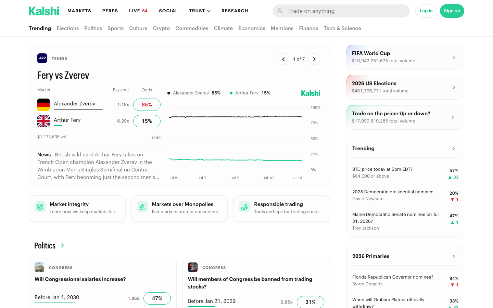

### 17% scroll depth

*Scroll position: 544px of 4100px total*

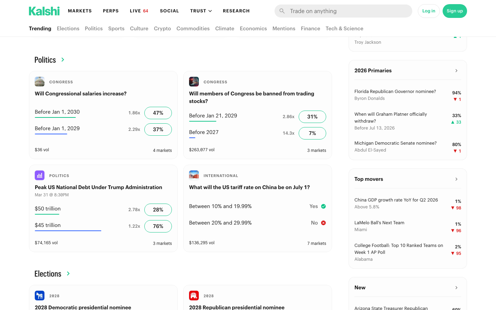

### 33% scroll depth

*Scroll position: 1056px of 4100px total*

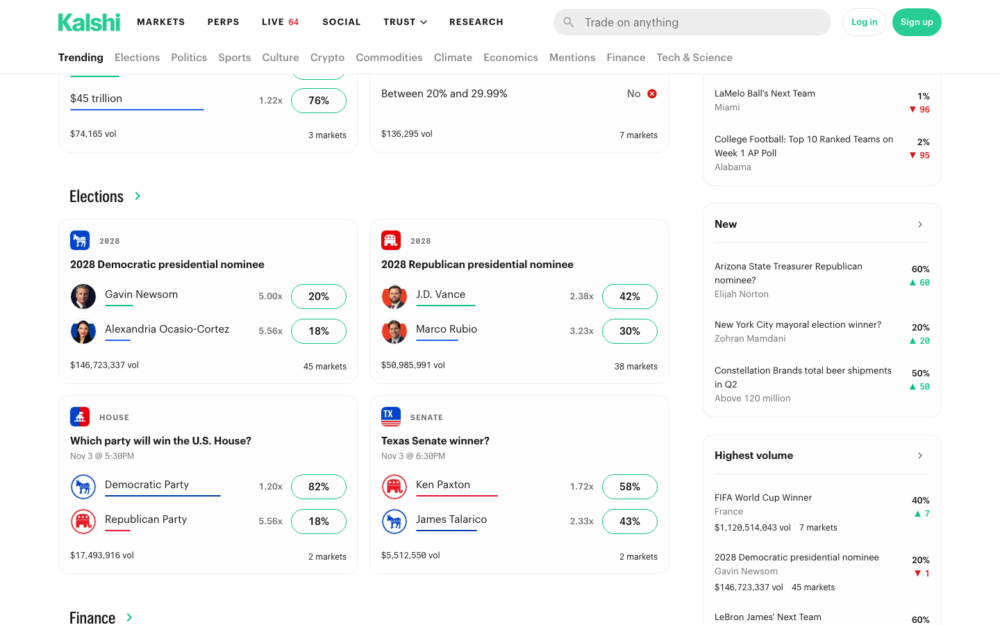

### 50% scroll depth

*Scroll position: 0px of 4100px total*

### 67% scroll depth

*Scroll position: 0px of 4100px total*

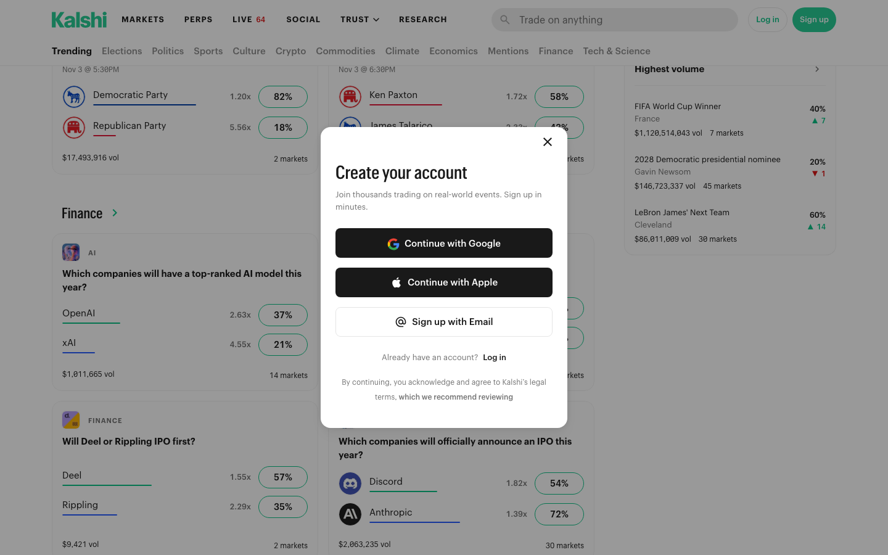

### 83% scroll depth

*Scroll position: 0px of 4100px total*

### Footer — End of page

*Scroll position: 0px of 4100px total*

## Full Page Screenshots

### Kalshi - Prediction Market for Trading the Future

*URL: `https://kalshi.com`*

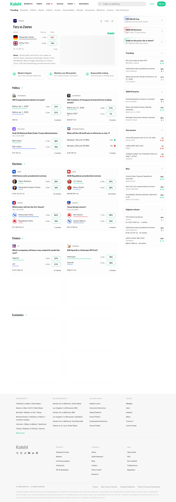

### Browse Markets | Kalshi

*URL: `https://kalshi.com/browse`*

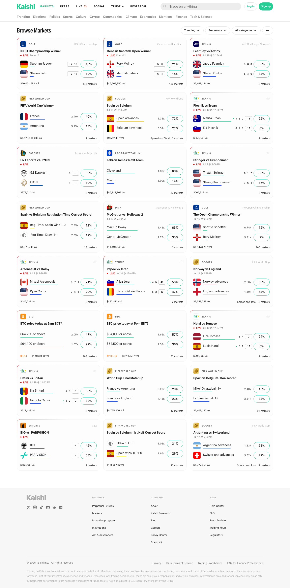

### Perpetual Futures - Kalshi

*URL: `https://kalshi.com/perps`*

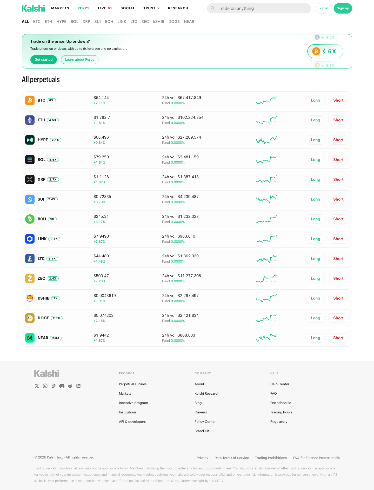

### Kalshi Event Calendar: Trade on Future Events

*URL: `https://kalshi.com/calendar`*

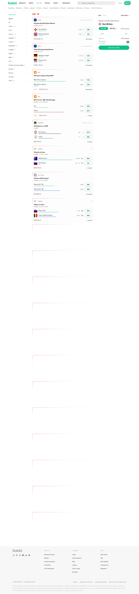

### Kalshi Social

*URL: `https://kalshi.com/ideas/feed`*

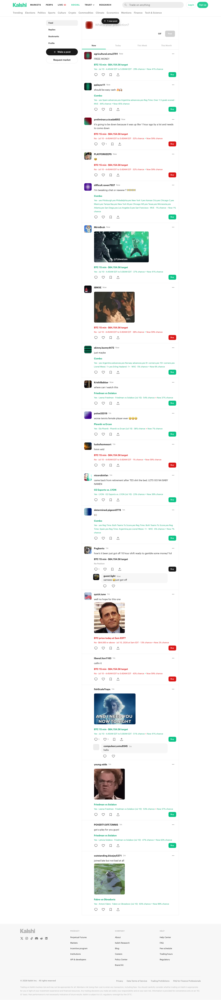

### Kalshi Research

*URL: `https://kalshi.com/research/mission`*

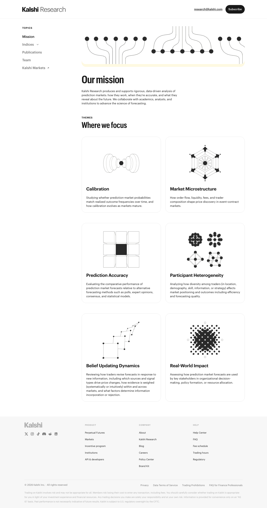

### Election Prediction Markets & Political Odds | Kalshi

*URL: `https://kalshi.com/category/elections`*

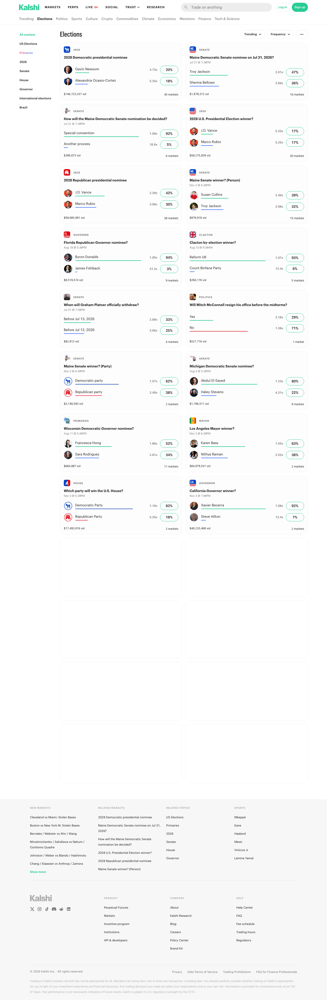

### Politics Prediction Markets & Odds | Kalshi

*URL: `https://kalshi.com/category/politics`*

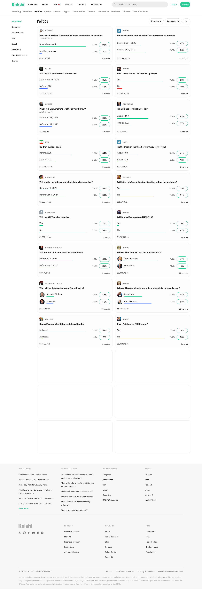

## Section Screenshots

Clipped sections showing individual components in context.

### Section 1 — `section`

*880×427px*

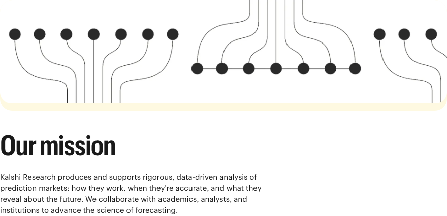

### Section 2 — `section`

*880×1200px*

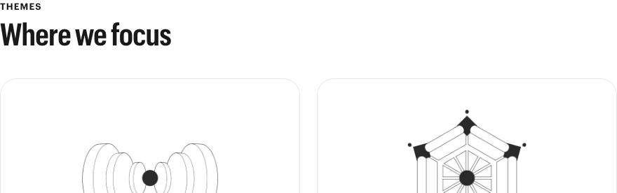

