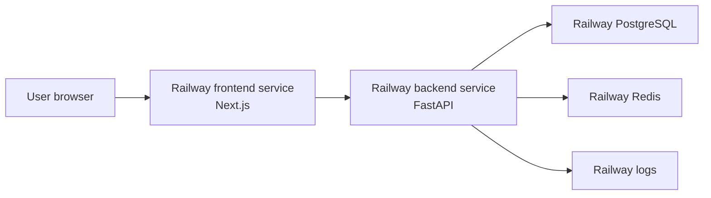
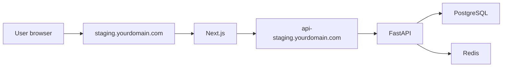

# Pred-Market Railway Hosting Master Plan

This is the living deployment plan for hosting Pred-Market cheaply on Railway first, while keeping the architecture professional enough to move to AWS or another provider later.

Railway replaces AWS infrastructure complexity for now. It does not remove the application pieces Pred-Market needs:

```text
Frontend service
Backend service
Postgres database
Redis database
Environment variables
Temporary Railway domain, custom domain later
Auth + MFA
Migrations
Backups
Monitoring/logs
```

## Current Hosting Direction

Use one Railway project:

```text
Project: wholesome-mindfulness
```

Services inside the project:

```text
pred-market
  Next.js application

pred-market-backend
  FastAPI application

Postgres
  Railway PostgreSQL database

Redis
  Railway Redis database
```

Temporary domain:

```text
Use Railway-generated domains first.
Example:
  frontend-production.up.railway.app
  backend-production.up.railway.app
```

Custom domain later:

```text
staging.yourdomain.com
api-staging.yourdomain.com
```

Because there is no domain yet, the first Railway deployment will use separate Railway service domains. That means CORS and cookie settings must explicitly allow the frontend Railway URL.

## Decisions Already Made

```text
Hosting provider: Railway
Environment: staging first
Funds: simulated only
Frontend: Next.js service
Backend: FastAPI service
Database: Railway PostgreSQL
Redis: Railway Redis
Auth owner: FastAPI backend
Tokens: HttpOnly cookies
Admin MFA: required
Trader MFA: optional later
Demo seed: disabled on Railway
Payments/KYC: not included yet
```

## Production-Staging Decisions

```text
Railway project: wholesome-mindfulness
Region: Southeast Asia when supported for all four services; otherwise keep all in US West
Build mode: Dockerfiles
Public signup: enabled
Initial admin: bindelapreetham2004@gmail.com
Admin password: sealed one-time Railway variable, then deleted
MFA recovery codes: 10 one-time codes, hashed at rest
Backend availability: persistent service
```

Locked defaults:

```text
Project name: wholesome-mindfulness
Region: Southeast Asia for all services when available; otherwise US West for all
Build mode: Dockerfiles with per-service config-as-code
Public sign-up: enabled
Initial admin: created by one-time bootstrap command
Admin password: generated outside Git and rotated after first login
MFA recovery codes: 10 one-time codes, hash at rest
Backups: daily, weekly, and one manual post-seed backup
Budget ceiling: low hard limit in Railway
Backend sleep: off while testing trading and WebSockets
```

## Architecture



When a custom domain exists later:



## What Codex Has To Do

### 1. Railway Deployment Foundation

Create or update:

```text
railway.json or Railway deployment docs
Dockerfile.frontend if needed
backend/Dockerfile if needed
.env.railway.example
docs/deployment/railway/*
```

Backend must support Railway's dynamic `PORT` environment variable.

Frontend must support:

```text
NEXT_PUBLIC_USE_MOCK_DATA=false
NEXT_PUBLIC_USE_DIRECT_API=false
INTERNAL_API_BASE_URL=http://${{pred-market-backend.RAILWAY_PRIVATE_DOMAIN}}:8080
NEXT_PUBLIC_WS_BASE_URL=wss://${{pred-market-backend.RAILWAY_PUBLIC_DOMAIN}}
```

Backend must support:

```text
ENVIRONMENT=staging
DATABASE_URL=${{Postgres.DATABASE_URL}}
REDIS_URL=${{Redis.REDIS_URL}}
CORS_ORIGINS=https://FRONTEND_RAILWAY_DOMAIN
COOKIE_SECURE=true
JWT_SECRET_KEY=strong_random_secret
DEMO_SEED_ENABLED=false
```

### 2. Landing Page

Create a minimalistic public landing page at `/`.

Requirements:

```text
Calm graphite design
No casino styling
No loud gradients
Clear product identity
Clear Sign in / Create account / Explore markets actions
Signed-in users can continue to market dashboard
Responsive mobile layout
```

Important behavior:

```text
Signed out user opens /
  -> sees landing page

Signed in user opens /
  -> can go to /markets quickly
```

Do not break existing `/markets`.

### 3. Production-Safe Admin Bootstrap

Create a one-time admin creation command.

Possible command:

```bash
python -m app.seed.create_admin
```

It should:

```text
Read admin email from env
Read admin password from env
Create admin user if missing
Assign USER and ADMIN roles
Create wallet if required by current schema
Mark email verified for bootstrap admin
Write audit log
Refuse to overwrite existing admin password
Refuse weak password
Never print password
```

Environment variables:

```text
ADMIN_BOOTSTRAP_EMAIL
ADMIN_BOOTSTRAP_PASSWORD
```

### 4. Auth + MFA

Implement TOTP authenticator-app MFA.

Backend tables:

```text
user_mfa_factors
mfa_challenges
mfa_recovery_codes
```

Backend APIs:

```text
POST /api/v1/auth/mfa/totp/setup
GET  /api/v1/auth/mfa/totp/qr
POST /api/v1/auth/mfa/totp/confirm
POST /api/v1/auth/mfa/challenge/verify
POST /api/v1/auth/mfa/recovery-codes/regenerate
DELETE /api/v1/auth/mfa/factors/{factor_id}
```

Rules:

```text
Admin MFA is mandatory.
Admin routes require MFA.
Trader MFA can be optional in staging.
TOTP secrets must be encrypted or otherwise protected at rest.
Recovery codes must be hashed at rest.
All MFA actions write audit logs.
```

Frontend screens:

```text
/account/security
/sign-in MFA challenge step
MFA setup QR code screen
Recovery codes display after setup
Admin blocked-state screen if MFA is missing
```

### 5. Migrations

Railway deployment must include a documented migration command:

```bash
alembic upgrade head
```

Migrations should be run manually first. Later, CI/CD can run them as a controlled deploy step.

Codex must document:

```text
How to run migrations in Railway
How to verify current migration head
How to recover if a migration fails
```

### 6. Backups

Codex must document the staging backup approach.

Minimum:

```text
Enable Railway volume/database backups if available for the plan.
Add manual pg_dump command.
Document restore procedure.
```

Later:

```text
Automated daily pg_dump to S3/R2.
Restore drill before production launch.
```

### 7. Monitoring And Logs

Codex must document:

```text
Railway service logs
Backend health endpoint
Frontend deployment logs
Database connection checks
Redis connection checks
Error patterns to watch
```

Minimum health check:

```bash
curl https://BACKEND_RAILWAY_DOMAIN/api/v1/health
```

Expected:

```json
{
  "status": "ok",
  "database": "ok",
  "redis": "ok"
}
```

## What You Have To Do

### 1. Railway Account

Create or log into Railway:

```text
https://railway.com
```

Connect your GitHub account.

### 2. Create Project

Create project:

```text
pred-market-staging
```

### 3. Add Services

Add:

```text
PostgreSQL
Redis
Frontend from GitHub repo
Backend from GitHub repo
```

### 4. Set Railway Variables

Backend variables:

```text
ENVIRONMENT=staging
DATABASE_URL=${{Postgres.DATABASE_URL}}
REDIS_URL=${{Redis.REDIS_URL}}
CORS_ORIGINS=https://FRONTEND_RAILWAY_DOMAIN
COOKIE_SECURE=true
JWT_SECRET_KEY=generate_with_openssl
DEMO_SEED_ENABLED=false
```

Frontend variables:

```text
NEXT_PUBLIC_USE_MOCK_DATA=false
NEXT_PUBLIC_USE_DIRECT_API=true
NEXT_PUBLIC_API_BASE_URL=https://BACKEND_RAILWAY_DOMAIN
```

Generate JWT secret locally:

```bash
openssl rand -base64 48
```

### 5. Temporary Domains

Use Railway-generated domains first.

You need to copy:

```text
Frontend Railway domain
Backend Railway domain
```

Then update:

```text
Backend CORS_ORIGINS = frontend domain
Frontend NEXT_PUBLIC_API_BASE_URL = backend domain
```

### 6. Run Migrations

After Postgres and backend variables are set:

```bash
alembic upgrade head
```

Run from Railway shell or one-off command.

### 7. Create First Admin

After Codex adds the bootstrap command, set:

```text
ADMIN_BOOTSTRAP_EMAIL=your email
ADMIN_BOOTSTRAP_PASSWORD=<sealed one-time strong password>
```

Run:

```bash
python -m app.seed.create_admin
```

Then:

```text
Sign in.
Set up MFA.
Rotate/change password if needed.
Remove bootstrap password variable.
```

### 8. Test Application

Smoke test:

```text
Open landing page.
Open /markets.
Create trader account.
Sign in.
Add simulated funds if allowed.
Open a market.
Place limit order.
Cancel order.
Open profile.
Open admin.
Create/approve market.
Confirm audit/admin access.
```

## Environment Variables Reference

### Backend

```text
ENVIRONMENT
DATABASE_URL
REDIS_URL
CORS_ORIGINS
COOKIE_SECURE
JWT_SECRET_KEY
DEMO_SEED_ENABLED
ADMIN_BOOTSTRAP_EMAIL
ADMIN_BOOTSTRAP_PASSWORD
```

### Frontend

```text
NEXT_PUBLIC_USE_MOCK_DATA
NEXT_PUBLIC_USE_DIRECT_API
NEXT_PUBLIC_API_BASE_URL
```

## Railway Deployment Commands

Optional CLI path:

```bash
npm install -g @railway/cli
railway login
railway link
railway status
```

Most setup can also be done through the Railway dashboard.

## Temporary Domain Cookie Notes

During temporary Railway-domain staging:

```text
Frontend and backend may be on different Railway domains.
COOKIE_SECURE must be true.
SameSite=Lax may work for top-level navigation but cross-origin API cookies can be tricky.
If auth cookies fail, move to a custom domain/subdomain pair or same-origin proxy setup.
```

Preferred later:

```text
Frontend: staging.yourdomain.com
Backend: api-staging.yourdomain.com
Cookie domain: .yourdomain.com
```

Best later:

```text
Same-origin API proxy:
https://staging.yourdomain.com/api/v1/*
```

## Risks And Controls

### Risk: Demo Credentials Public

Control:

```text
DEMO_SEED_ENABLED=false
Do not run dev seed in Railway.
Use bootstrap admin only.
```

### Risk: Database Loss

Control:

```text
Enable Railway backups.
Add manual pg_dump command.
Document restore.
```

### Risk: Auth Cookies Fail Across Railway Domains

Control:

```text
Start with direct API mode.
Test sign-in immediately.
Move to custom domain if cookie behavior blocks testing.
```

### Risk: Unexpected Cost

Control:

```text
Set Railway usage limits.
Keep staging traffic private.
Avoid unnecessary replicas.
Avoid heavy background jobs.
```

### Risk: Admin Account Takeover

Control:

```text
Mandatory admin MFA.
Strong admin password.
Audit logs.
No shared admin credentials.
```

## Implementation Checklist

### Codex

```text
[ ] Add Railway deployment docs.
[ ] Add Railway env example.
[ ] Adjust backend startup for Railway PORT.
[ ] Add landing page.
[ ] Add production admin bootstrap command.
[ ] Add TOTP MFA backend schema.
[ ] Add TOTP MFA backend routes.
[ ] Add MFA frontend flow.
[ ] Add migration/runbook docs.
[ ] Add backup/runbook docs.
[ ] Add monitoring/log docs.
[ ] Run tests and builds.
```

### You

```text
[ ] Create Railway account.
[ ] Connect GitHub repo.
[ ] Create pred-market-staging project.
[ ] Add PostgreSQL service.
[ ] Add Redis service.
[ ] Add backend service.
[ ] Add frontend service.
[ ] Copy Railway-generated frontend/backend domains.
[ ] Set Railway variables.
[ ] Run migrations.
[ ] Run admin bootstrap.
[ ] Sign in and set up MFA.
[ ] Test market creation and trading.
[ ] Set usage limit/budget.
[ ] Decide custom domain later.
```

## Completion Definition

Railway staging is considered ready when:

```text
Landing page loads on Railway domain.
Frontend can call backend.
Backend health returns database ok and redis ok.
Postgres migrations are applied.
Admin account exists.
Admin MFA is enabled.
Markets page loads with real backend mode.
Trader can sign up/sign in.
Simulated wallet and order flow work.
Admin can create/approve markets.
Logs are visible.
Backup path is documented.
```
